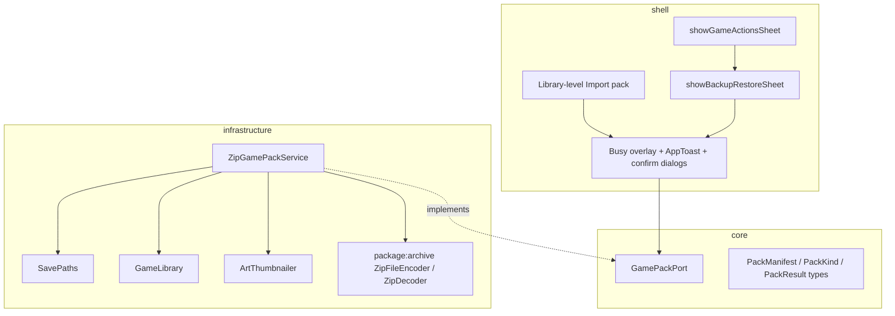
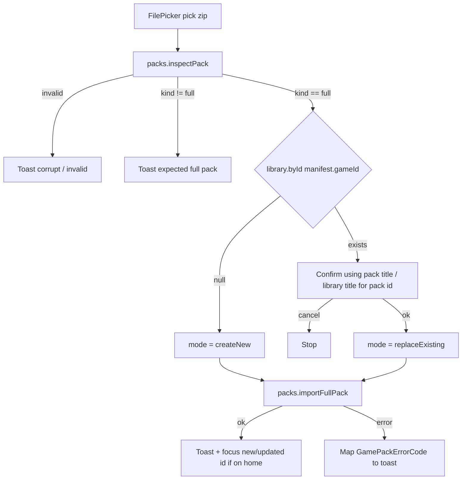
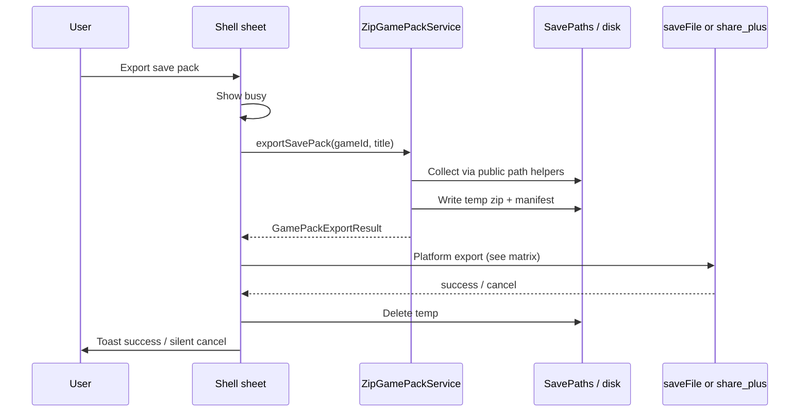
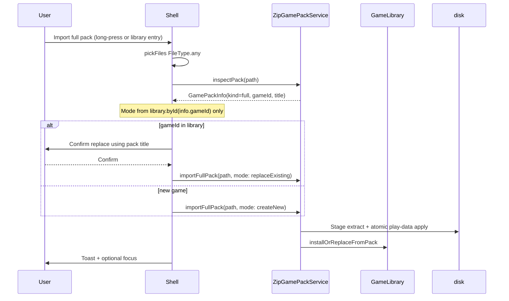

# Design: Game Backup Packs (Save Pack & Full Pack)

| Field | Value |
|-------|--------|
| **Document** | Game Backup Packs — export/import progress & full library snapshots |
| **Author** | (TBD) |
| **Date** | 2026-08-05 |
| **Status** | Draft (rev 3 — residual review issues addressed) |
| **App** | lemonGba (`gba_emulator`) |
| **Primary surfaces** | (1) Long-press game → `showGameActionsSheet` → Backup & restore… (2) Library-level **Import pack…** (header + empty-state CTA) |

---

## Overview

Players need a reliable way to **back up and restore** a game’s progress (and optionally the full library entry) without manually hunting through app-private directories.

This design adds:

1. **Per-game** long-press entry **“Backup & restore…”** with four actions:
   - **Export save pack** — cartridge save + quick/manual savestates + quick-rotate meta  
   - **Import save pack** — restore progress onto the **same** title (game id must match the long-pressed game)  
   - **Export full pack** — ROM + library metadata + custom art + all save/progress data  
   - **Import full pack** — recreate or refresh a complete library entry; identity comes from the **pack**, not the long-pressed tile  
2. **Library-level “Import pack…”** (library header menu + empty library / empty home CTA) so a **reinstall with zero games** can still restore full packs — the flagship restore path.

Both pack kinds use the extension **`.lemongba.zip`**, distinguished by **filename stems** (`.saves.` vs `.full.`) and, authoritatively, by a versioned **`manifest.json`** (`kind: "saves" | "full"`).

Packaging lives in **infrastructure** behind a new **core** contract. The shell only orchestrates pickers, confirms, busy chrome, and toasts — it does not compute savestate paths.

---

## Background & Motivation

### Current state

| Concern | Owner today | Path / API |
|---------|-------------|------------|
| Cartridge `.sav` | `SavePaths.savPathForGame` | `saves/<gameId>.sav` |
| Quick states (10) | `SavePaths` / `FileSaveStateRepository` | `states/<gameId>/quickN.state` |
| Manual states (5) | same | `states/<gameId>/slotN.state` |
| Quick ring meta | `SavePaths` | `states/<gameId>/quick_rotate.json` (today via private `_quickRotateMetaPath` — **must expose** `quickRotateMetaPathForGame` for packaging) |
| ROM copy | `GameLibrary` | `roms/<shortId8>_<stem>.gba` |
| Library index | `GameLibrary` | `library.json` (`LibraryGame` fields) |
| Avatar / cover | `GameLibrary` + `ArtThumbnailer` | `covers/` originals + `*_tile.png` / `*_bg.png` |
| Game identity | `RomIdentity` | SHA-256 of ROM bytes |

Long-press actions today (`lib/shell/home/game_actions_sheet.dart`) only expose **Add to group…**, optional **Remove from group**, and **Display settings**. There is no backup path and **no library-level import** for packs.

Users who switch phones, clear app data, or reinstall lose progress unless they manually copy private app storage. After reinstall the shelf is **empty** — long-press alone cannot restore a full pack. A library-level import entry is required for that scenario.

### Pain points

- App support dir is opaque; no documented user-facing backup.  
- Save data is split across cartridge + many state files + rotation JSON — easy to miss pieces.  
- Re-importing a ROM (same content hash → same `gameId`) is not a transfer tool.  
- Free-tier art caps (`FreeLimits.maxAvatars` / `maxCovers`) must still apply when a **full pack** introduces **new** custom art.  
- Empty-library reinstall has no tile to long-press.

### Constraints (from architecture)

From `docs/architecture.md` and `docs/shell.md`:

- **shell → application → core ← infrastructure**  
- Shell must not own savestate paths or packaging I/O.  
- **Play-session** savestate I/O remains only through `SaveStateRepository` / `FileSaveStateRepository`.  
- **Architecture exception:** packaging (`ZipGamePackService`) is a **second privileged writer** of the same play-data paths (`.sav`, `states/<gameId>/*`, including `quick_rotate.json`). This is intentional bulk restore; session code must not grow zip concerns, and pack code must not become a general second API for slot save/load. Document this dual-writer exception in `docs/architecture.md` when packaging lands (PR 3a).  
- Prefer pure Dart where possible so **Android + Windows** desktop in-repo both work.

---

## Goals & Non-Goals

### Goals

1. Export/import **save packs** that restore true last-moment progress (`.sav` + all existing quick/manual slots + `quick_rotate.json`).  
2. Export/import **full packs** that restore ROM + library meta + art + saves.  
3. **Reinstall restore:** import full packs with an **empty library** (no long-press required).  
4. Unambiguous **file naming** so users never confuse save-only vs full packs.  
5. Versioned **manifest** for forward compatibility.  
6. Safe failures: wrong-game save import → clear toast; corrupt/unknown format → clear toast.  
7. Merge policy for full pack when the game id already exists (confirm + overwrite).  
8. Free-tier respect for **new** custom art on import; no library size cap today (none in `FreeLimits`).  
9. **Atomic play-data apply** so a failed import never zeros local progress.  
10. Busy / progress UX consistent with lemon chrome.  
11. Architecture-clean: core contract + infrastructure zip implementation + shell UI.  
12. Incremental, reviewable PR plan (split save vs full service work).

### Non-Goals

- Cloud backup / accounts / multi-device sync.  
- Encrypting packs (ROMs are user-owned; packs are local/share files).  
- Backing up groups membership, play layout, or Pro entitlement.
- In-play backup from the pause menu (library/home only for v1).  
- Importing foreign emulator formats (RetroArch, mGBA standalone, etc.).  
- Partial slot pickers (“export only slot 3”) — all-or-nothing snapshot.  
- iOS-specific polish (Android-first; Windows kept working).  
- Rewriting `SaveStateRepository` to stream zip (separate concern).  
- Importing a **save pack** from the library-level entry when no matching game exists (save packs always need a target game id).

---

## Key Decisions

| # | Decision | Rationale |
|---|----------|-----------|
| K1 | **Two pack kinds**: `saves` and `full`, one zip extension `.lemongba.zip` | Single extension for OS tools; kind in manifest + filename token. |
| K2 | **Filename scheme**: `{title}_{id8}.saves.lemongba.zip` / `{title}_{id8}.full.lemongba.zip` | Human-readable; import trusts **manifest.kind** first. |
| K3 | **New core contract** `GamePackPort` + infra `ZipGamePackService` | Shell never owns paths; packaging testable without Flutter. |
| K4 | **Dependency: `archive` (+ `archive_io`)** pure Dart | Android **and** Windows; stream encode via `ZipFileEncoder`. |
| K5 | **Save-pack import is game-id gated** against the target game (long-press context) | Prevents cross-ROM save apply. |
| K6 | **Play-data import = full snapshot of pack members** | After apply, live play data equals the pack exactly: present state members only under `states/<id>/`; live `.sav` exists **iff** pack had `saves/cartridge.sav`. Omitted cartridge → remove live `.sav`. Empty pack (`files: []`) clears **all** play data (states tree + cartridge). Not a merge. |
| K7 | **Full import identity = pack `gameId` only** | Long-pressed tile is **entry context only** for full import; mode = `library.byId(manifest.gameId)`. |
| K8 | **Full import existing = confirm then overwrite** meta, art (tier-aware), play data; **always** copy ROM from pack when staged hash matches | Repairs truncated/corrupt local ROM; clears `missing`. Groups **kept**. |
| K9 | **Full import new = create entry + install all** | Art subject to free caps; upsert by content id if orphan ROM exists. |
| K10 | **Art thumbs not required in pack** | Originals only; regenerate thumbs on import. |
| K11 | **Export delivery (v1 platform matrix)** | **Windows/desktop:** `FilePicker.saveFile` (path/bytes). **Android:** prefer `share_plus` of the temp zip for full packs and for any pack over a size threshold (~4 MB); small save packs may still use `saveFile(bytes:)`. Size-aware: never blindly buffer 40 MB without a fallback path. |
| K12 | **UI labels** | Per-game **“Backup & restore…”**; library-level **“Import pack…”**. |
| K13 | **No application-layer controller for v1** | Orchestration lives in `backup_restore_sheet.dart` / shared shell helpers (inspect → confirm → mode → apply → toast). Extract `application/` later if it grows. |
| K14 | **Library-level import entry** | Library header + empty library CTA (+ empty home CTA) for full-pack reinstall restore. Save-pack import only from per-game sheet (needs target id). |
| K15 | **Atomic play-data apply + bak recovery** | Stage → write `*.importing` (full snapshot including cartridge tombstone when omitted) → validate → rename live → `*.bak` → importing → live. On failure leave/restore live. **Boot:** restore `*.bak` if live missing; never blind-delete `*.bak`; only delete `*.importing` freely. |
| K16 | **Art omit policy** | If pack has **no** art member, **keep local art**. Never wipe art because the pack omitted it. |
| K17 | **`addedAt` on replace** | **Keep local** `addedAt` (first-added history). Other meta fields come from pack. |
| K18 | **Create-new recency** | Keep pack `addedAt` for fidelity, but set **`lastPlayedAt = DateTime.now()`** so the restored game surfaces on `gamesByRecent` / home shelf. |
| K19 | **Empty save packs allowed** | Valid pack with `files: []` (or only rotate meta). Toast: plain `Save pack exported` (no special empty wording). |
| K20 | **`appVersion` in manifest** | **Omit or hardcode** optional string in v1 (e.g. `"1.0.0+7"`). No `package_info_plus` dependency. |
| K21 | **Shared filename sanitizer** | Extract pure `safeFileStem(name, {maxLength})` used by ROM naming and pack filenames (default max 48 for ROM; pack export uses max **40** for the title segment so full names fit). Unit-tested once. |
| K22 | **Import picker filters** | **All platforms:** `FileType.any` + manifest validation (double extension is flaky in OS filters). |
| K23 | **Meta art/ROM filenames are not on-disk sources** | Importer uses only zip members `rom/*`, `art/*`; mints local names via `avatarFileNameFor` / `coverBannerFileNameFor` / `{id8}_{stem}{ext}`. Ignore export-time `avatarFileName` / `coverFileName` / `romFileName` as path sources (may use display stem hints only). |

---

## Proposed Design

### High-level architecture



**Dependency rule:** Construct `ZipGamePackService` once at boot (`_BootData` / `_loadLibrary` next to `SavePaths` + `GameLibrary`). Pass `GamePackPort packs` into `HomeScreen`, then into `LibraryGridScreen` and sheet helpers. Infrastructure may import `SavePaths`, `GameLibrary`, and `dart:io`. Core stays free of Flutter/`File`.

### Shell injection (required wiring)

Today `LibraryGridScreen` only receives `library`, `pro`, and callbacks from `HomeScreen` — no pack service.

**Chosen pattern (testable, explicit):**

```text
main / _CoreBootGate
  → SavePaths.open()
  → GameLibrary(paths, pro: …)
  → ZipGamePackService(paths: paths, library: library)  // implements GamePackPort; no SaveStateRepository
  → HomeScreen(..., packs: gamePackPort)
       → LibraryGridScreen(..., packs: packs)
       → showGameActionsSheet(..., onBackupRestore: () { … showBackupRestoreSheet(packs, library, game) })
       → showBackupRestoreSheet(packs: packs, library: library, game: game)
       → library header / empty CTA → importPackFromPicker(packs, library)
```

| API | New / changed parameter |
|-----|-------------------------|
| `HomeScreen` | `required GamePackPort packs` |
| `LibraryGridScreen` | `required GamePackPort packs` |
| `showGameActionsSheet` | `required VoidCallback onBackupRestore` only — **does not** take `GamePackPort` (matches existing `onAddToGroup` / `onDisplaySettings` style) |
| `showBackupRestoreSheet` | `required GamePackPort packs`, `required GameLibrary library`, `required LibraryGame game` |
| Library-level import helper | `required GamePackPort packs`, `required GameLibrary library`, `required BuildContext context` — **no** `LibraryGame` |

Do **not** construct `ZipGamePackService` inside sheet functions or as a global singleton. Callers that own `packs` close over it when building `onBackupRestore`.

### UI entry & labels

#### A. Per-game (long-press)

**File:** `lib/shell/home/game_actions_sheet.dart` (shared home + library).

Add after Display settings:

| Element | Copy |
|---------|------|
| Long-press row | **Backup & restore…** |
| Icon | Prefer a backup-like Hugeicon that **resolves in the project’s current `hugeicons` package** during PR 4. **Safe fallback:** `HugeIcons.strokeRoundedFloppyDisk` (already used in pause menu). Do not invent unresolved symbol names. |
| Callback | `onBackupRestore` — sheet pops itself then host opens `showBackupRestoreSheet` (same pattern as `onDisplaySettings`) |
| Sub-sheet title | **Backup · {game.title}** |

`showGameActionsSheet` stays free of infrastructure ports. Sub-sheet (`lib/shell/home/backup_restore_sheet.dart`) receives `packs` + `library` + `game`. Rows:

| Order | Label | Behavior |
|------:|-------|----------|
| 1 | Export save pack | Build `.saves.lemongba.zip` → platform export |
| 2 | Import save pack | Pick zip → kind+`expectedGameId == game.id` → confirm → apply |
| 3 | Export full pack | Build `.full.lemongba.zip` → platform export |
| 4 | Import full pack | Pick zip → **ignore** long-pressed id for identity → full-pack state machine |

Pop game actions sheet, then open backup sheet (same pattern as group picker).

#### B. Library-level import (reinstall path)

| Surface | Entry | Behavior |
|---------|-------|----------|
| Library grid header | Overflow / menu action **Import pack…** | Pick file → inspect → if `kind == full` run full-pack state machine; if `kind == saves` toast `Open a game’s Backup & restore to import a save pack` |
| Empty library CTA | Same **Import pack…** on empty state | Same as header |
| Empty home shelf (optional, recommended) | Secondary action **Import pack…** next to add-ROM | Same helper |

Shared function e.g. `importPackFromPicker({required BuildContext context, required GamePackPort packs, required GameLibrary library})` in `backup_restore_sheet.dart`.

**Busy chrome:** modal barrier + compact progress card (`PlayModal.surface`, short “Exporting…” / “Importing…”). Local `_busy` to prevent double-taps. Avoid full `LemonLoadingScreen` dock for pack I/O.

**Toasts** (`AppToast`):

| Outcome | Message (examples) |
|---------|-------------------|
| Export OK | `Save pack exported` / `Full pack exported` |
| Import saves OK | `Progress restored` |
| Import full OK (new) | `“{packTitle}” added from pack` |
| Import full OK (merge) | `“{packTitle}” updated from pack` |
| Wrong game (save) | `This pack belongs to a different game` |
| Wrong kind | `Expected a save pack` / `Expected a full pack` |
| Save pack via library entry | `Open a game’s Backup & restore to import a save pack` |
| Corrupt | `Could not read this Lemon pack` |
| Cancelled picker | silent |
| Free art skipped | `Imported without tile art (free plan limit)` (and/or cover) |
| Missing ROM on export full | `ROM file missing — cannot export full pack` |
| Export too large / share failed | `Could not export pack` |

### Full pack import state machine (shell + service)

Applies to **both** long-press “Import full pack” and library-level “Import pack…” when `kind == full`.



**Rules:**

1. **Long-pressed `game.id` is not used for full-pack identity.** Only `manifest.gameId` decides create vs replace.  
2. Confirm / toast titles always use **pack** display name: `info.title` ?? library title for that id ?? `"Game"`.  
3. If long-press context exists and `game.id != info.gameId`, confirm body includes: *“This pack is for a different game than the one you selected.”*  
4. **ROM extension:** staged ROM must be `.gba` or `.bin` only (`GameLibrary.romExtensions`).  
5. **Hash integrity:** `RomIdentity.fromFile(stagedRom).value == manifest.gameId` else `corruptEntry`.  
6. **Meta filenames:** do not use `library_entry.json`’s `avatarFileName` / `coverFileName` / `romFileName` as source paths. Install from `rom/*` and `art/*` only; mint local names. If meta `id` ≠ `manifest.gameId` → `corruptEntry`.  
7. **Orphan / id collision:** if `roms/` already has the same content hash (or `byId` exists), **upsert by id** (same spirit as `addFromPath`) — never create a second library row or blind second ROM file for the same hash.  
8. **Post-import UX:** pop sheets; `AppToast.success`; on home, set focus / shelf attention to `result.gameId` (reuse `_runImportProgress`-style or focus id) when context is home; library grid relies on `notifyListeners` rebuild.  
9. **Create-new timestamps:** `addedAt` from pack (or now if missing); **`lastPlayedAt = DateTime.now()`** (K18).  
10. **Replace-existing timestamps:** keep local `addedAt`; take pack `displayName`, `description`, `headerTitle`, `lastPlayedAt`.

### Sequence: export save pack



### Sequence: import full pack (identity from pack)



---

## Pack format

### File naming (required)

| Kind | Pattern | Example |
|------|---------|---------|
| Save pack | `{sanitizedTitle}_{shortId8}.saves.lemongba.zip` | `Pokemon_Emerald_a1b2c3d4.saves.lemongba.zip` |
| Full pack | `{sanitizedTitle}_{shortId8}.full.lemongba.zip` | `Pokemon_Emerald_a1b2c3d4.full.lemongba.zip` |

**Sanitization** via shared pure helper (K21):

```dart
// e.g. lib/core/storage/safe_file_stem.dart or next to pack helpers
String safeFileStem(String name, {int maxLength = 48}) {
  var stem = /* basename without extension if path-like */;
  stem = stem.replaceAll(RegExp(r'[^\w\-. ]+'), '_').trim();
  if (stem.isEmpty) stem = 'game';
  if (stem.length > maxLength) stem = stem.substring(0, maxLength);
  return stem;
}
```

- Pack title segment: `safeFileStem(title, maxLength: 40)`.  
- ROM naming continues with `maxLength: 48` (migrate `GameLibrary._safeFileStem` to call the shared helper).  
- `shortId8` = first 8 hex chars of `gameId`.

**Import detection order:**

1. Open zip → parse `manifest.json` → require `format == "lemongba.pack"` and `version == 1`.  
2. Use `manifest.kind`.  
3. If manifest missing/unreadable → fail.  
4. Filename tokens are UX/docs only; optional warning if filename kind ≠ manifest kind.

**Extension:** always `.lemongba.zip`.

### Zip layout

#### Save pack (`kind: "saves"`)

```text
manifest.json
saves/cartridge.sav          # optional if absent on disk at export
states/quick1.state … quick10.state   # only files that exist
states/slot1.state … slot5.state
states/quick_rotate.json     # optional if absent
```

#### Full pack (`kind: "full"`)

```text
manifest.json
rom/game.gba                 # extension .gba or .bin only
meta/library_entry.json      # LibraryGame JSON (no missing); path fields are hints only
art/avatar.<ext>             # optional
art/cover.<ext>              # optional
saves/cartridge.sav
states/…
```

**Not included:** derived thumbs, groups, `play_layout.json`, entitlements.

### `manifest.json` (version 1)

```json
{
  "format": "lemongba.pack",
  "version": 1,
  "kind": "saves",
  "gameId": "<sha256 hex>",
  "exportedAt": "2026-08-05T12:34:56.789Z",
  "appVersion": "1.0.0+7",
  "title": "Pokémon Emerald",
  "romFileName": "a1b2c3d4_Pokemon_Emerald.gba",
  "romExtension": ".gba",
  "files": [
    { "path": "saves/cartridge.sav", "role": "cartridge" },
    { "path": "states/quick1.state", "role": "quick", "slot": 1 },
    { "path": "states/slot2.state", "role": "manual", "slot": 2 },
    { "path": "states/quick_rotate.json", "role": "quick_rotate" },
    { "path": "rom/game.gba", "role": "rom" },
    { "path": "meta/library_entry.json", "role": "library_entry" },
    { "path": "art/avatar.jpg", "role": "avatar" },
    { "path": "art/cover.png", "role": "cover" }
  ]
}
```

| Field | Required | Notes |
|-------|----------|--------|
| `format` | yes | `"lemongba.pack"` |
| `version` | yes | Accept only `1` in v1 importers |
| `kind` | yes | `"saves"` \| `"full"` |
| `gameId` | yes | Full SHA-256 hex |
| `exportedAt` | yes | ISO-8601 UTC |
| `appVersion` | no | Hardcoded optional string; omit freely (K20) |
| `title` | no | Confirm/toast hint |
| `romFileName` | full only | **Hint only** for stem display; not a source path |
| `romExtension` | full only | `.gba` / `.bin` |
| `files` | yes | Inventory of members present |

### `meta/library_entry.json`

Use `LibraryGame.toJson()`. On import:

- Force `id` from **manifest.gameId**; if meta id present and differs → `corruptEntry`.  
- **Ignore** meta `avatarFileName` / `coverFileName` / `romFileName` as filesystem sources (K23).  
- Rewrite local `romFileName` when installing: `{shortId8}_{safeStem}{ext}` from pack title/hint + staged extension.

---

## API / Interface Changes

### Core contract (new)

**Path:** `lib/core/storage/game_pack_port.dart` (+ optional manifest parse helpers / `safe_file_stem.dart`)

```dart
enum GamePackKind { saves, full }

final class GamePackInfo {
  const GamePackInfo({
    required this.kind,
    required this.gameId,
    required this.exportedAt,
    this.title,
    this.formatVersion = 1,
  });

  final GamePackKind kind;
  final String gameId;
  final DateTime exportedAt;
  final String? title;
  final int formatVersion;
}

final class GamePackExportResult {
  const GamePackExportResult({
    required this.tempFilePath,
    required this.suggestedFileName,
    required this.byteLength,
    required this.kind,
  });

  final String tempFilePath;
  final String suggestedFileName;
  final int byteLength;
  final GamePackKind kind;
}

enum GamePackImportMode {
  replaceSaves,
  createNew,
  replaceExisting,
}

final class GamePackImportResult {
  const GamePackImportResult({
    required this.gameId,
    required this.kind,
    required this.createdNew,
    this.skippedAvatar = false,
    this.skippedCover = false,
    this.title,
  });

  final String gameId;
  final GamePackKind kind;
  final bool createdNew;
  final bool skippedAvatar;
  final bool skippedCover;
  final String? title;
}

abstract interface class GamePackPort {
  Future<GamePackExportResult> exportSavePack({
    required String gameId,
    required String titleForFileName,
  });

  Future<GamePackExportResult> exportFullPack({
    required String gameId,
    required String titleForFileName,
  });

  Future<GamePackInfo> inspectPack(String zipPath);

  /// [expectedGameId] must equal manifest.gameId (save packs only).
  Future<GamePackImportResult> importSavePack({
    required String zipPath,
    required String expectedGameId,
  });

  /// Shell chooses [mode] from inspect + library; service **hard-rejects**
  /// mismatches (createNew when id exists, replaceExisting when missing).
  Future<GamePackImportResult> importFullPack({
    required String zipPath,
    required GamePackImportMode mode,
  });
}
```

**Errors:**

```dart
enum GamePackErrorCode {
  invalidFormat,
  unsupportedVersion,
  wrongKind,
  wrongGame,
  romMissing,
  gameNotInLibrary,
  ioFailure,
  corruptEntry,
  modeMismatch,   // importFullPack: mode vs library.byId disagree
  notImplemented, // PR 3a stubs for full methods until PR 3b
  exportTooLarge, // optional shell-side if refusing buffer path
}
```

### Infrastructure — `SavePaths` packaging helpers (PR 2)

Expose (public or package-visible) so pack service does **not** re-encode private paths:

```dart
/// Absolute path of quick-rotate meta for [gameId].
String quickRotateMetaPathForGame(String gameId);

/// Optional inventory helper for packaging / tests.
List<({String absolutePath, String zipPath, String role, int? slot})>
  playDataMembersForGame(String gameId);
// Implementation lists cartridge + quick1..N + slot1..M + rotate meta paths
// using quickSaveSlotCount / manualSlotCount — no magic numbers in ZipGamePackService.
```

Also:

```dart
@visibleForTesting
factory SavePaths.forRoot(Directory root) => SavePaths._(root);
```

Smoke test: `forRoot` temp dir → write dummy `.sav` + `quick_rotate.json` via public paths → read back.

### Infrastructure — `ZipGamePackService`

**Path:** `lib/infrastructure/storage/zip_game_pack_service.dart`

| Method | Behavior |
|--------|----------|
| `exportSavePack` | Call `paths.ensureStateDir` + `paths.migrateLegacyQuickSaveIfNeeded` (**not** `SaveStateRepository.prepareGame` — pack service depends only on `SavePaths` + `GameLibrary`). Gather via `playDataMembersForGame` / path helpers; zip + manifest |
| `exportFullPack` | Same migrate; ROM must exist; add `rom/`, `meta/`, optional `art/` originals; save tree |
| `inspectPack` | Manifest only; validate format/version/kind/gameId (available in PR 3a for save tests; full kind allowed in inspect early) |
| `importSavePack` | Validate kind+gameId; stage; **atomic full-snapshot play-data apply**; no library row changes |
| `importFullPack` | Validate kind; **hard-check mode vs `library.byId`**; stage; ROM ext + hash; `installOrReplaceFromPack`; atomic play data |

**Constructor:** `ZipGamePackService({required SavePaths paths, required GameLibrary library})` — **no** `SaveStateRepository` injection. Legacy quick migration is owned by `SavePaths.migrateLegacyQuickSaveIfNeeded`.

**Mode vs library (defense in depth):** After reading manifest `gameId`:

| `mode` | `library.byId(gameId)` | Result |
|--------|------------------------|--------|
| `createNew` | null | proceed |
| `createNew` | non-null | `GamePackException(modeMismatch, …)` — do **not** coerce |
| `replaceExisting` | non-null | proceed |
| `replaceExisting` | null | `GamePackException(modeMismatch, …)` — do **not** coerce |

Shell bugs surface in tests instead of silent upsert surprises.

### Atomic play-data apply (required)

**Never** call `deletePlayDataForGame` and then copy from stage as the sole path — a mid-copy failure zeros progress.

**Full-snapshot semantics (K6):** After a **successful** apply, live play data equals the pack’s play members **exactly**:

| Pack content | Live after apply |
|--------------|------------------|
| State files / `quick_rotate.json` present | Only those files under `states/<gameId>/` (empty dir if pack has no state members) |
| `saves/cartridge.sav` **present** | Live `saves/<gameId>.sav` = pack bytes |
| `saves/cartridge.sav` **omitted** | Live `.sav` **must not exist** (removed as part of the same transactional apply) |
| Empty pack (`files: []` or no play members) | Empty `states/<gameId>/` (or absent) **and** no live `.sav` |

Cartridge is a **sibling file**, not inside the states tree — omitting it must not leave the old `.sav` (that would be merge, not snapshot).

**Required algorithm:**

1. Extract zip to `tmp/packs/import_<nonce>/` (zip-slip checked).  
2. Validate members for kind.  
3. Build **side-by-side** apply artifacts for the **full snapshot**:  
   - **States:** always create `states/<gameId>.importing/` (may be empty). Copy only pack state members into it (including `quick_rotate.json` if present). This directory **wholly replaces** live `states/<gameId>/` on swap — omitted slots disappear.  
   - **Cartridge:**  
     - If pack has `saves/cartridge.sav` → write `saves/<gameId>.sav.importing` with those bytes.  
     - If pack **omits** cartridge → write a **tombstone marker** `saves/<gameId>.sav.importing.tombstone` (empty marker file) meaning “delete live `.sav` on commit.” Do **not** skip the cartridge step.  
4. Validate staged apply trees (expected files readable; tombstone XOR `.sav.importing`).  
5. **Swap (states then cartridge, or document a fixed order):**  
   - If live `states/<gameId>/` exists → rename to `states/<gameId>.bak/`  
   - Rename `states/<gameId>.importing/` → `states/<gameId>/`  
   - Cartridge: if live `.sav` exists → rename to `.sav.bak`  
   - If `.sav.importing` exists → rename to live `.sav`  
   - If `.importing.tombstone` exists → ensure live `.sav` is gone (already moved to bak or deleted); delete tombstone  
6. On **any** failure before swap completes: delete `*.importing` / tombstone only; if live was already renamed to `.bak`, **restore `.bak` → live** before returning `ioFailure`. Never leave the user with only bak and no live.  
7. On success: delete `*.bak` and import staging zip dir (live is complete).  
8. **Boot recovery** (see below) heals crash between live→bak and importing→live.

In-play Windows locks remain out of scope for v1 (no in-play import UI). Library-side failures must not zero progress.

### Boot recovery for `*.bak` / `*.importing` (required)

Stale paths are **not** “safe to blind-delete.” Progress may live only in `.bak` after a crash mid-swap.

On service construct / app boot (PR 3a or PR 5 — prefer **PR 3a** with unit tests):

1. Scan `states/` for `*.bak` dirs and `saves/` for `*.sav.bak` (and known game ids if easier).  
2. **If `states/<id>.bak` exists and `states/<id>` is missing** → rename bak → live (restore).  
3. **If both `states/<id>` and `states/<id>.bak` exist** → prefer **live**; delete bak only after live dir is present.  
4. Same rules for `saves/<id>.sav` vs `.sav.bak`.  
5. **Delete `*.importing` and `*.importing.tombstone` freely** (incomplete applies; never the sole copy of good data after a correct algorithm).  
6. **Never delete `*.bak` unless live is present** (or bak was successfully restored to live).  
7. `tmp/packs/` wipe remains best-effort (exports/import staging only — not play data).

### `GameLibrary.installOrReplaceFromPack`

```dart
Future<({
  LibraryGame game,
  bool createdNew,
  bool skippedAvatar,
  bool skippedCover,
})> installOrReplaceFromPack({
  required String gameId,
  required String stagedRomPath,
  required Map<String, dynamic> libraryEntryJson, // from meta; paths ignored as sources
  String? stagedAvatarPath,
  String? stagedCoverPath,
  required bool replaceExisting,
  required DateTime? packAddedAt,
  required DateTime? packLastPlayedAt,
  // create-new: force lastPlayedAt = now inside implementation (K18)
});
```

Responsibilities:

- Extension allowlist on staged ROM.  
- Hash == `gameId`.  
- Upsert by id; mint `romFileName`; **always** copy ROM bytes from staged path when installing/replacing (K8).  
- Meta field rules (K16–K18).  
- Art from staged paths only; free-tier via `canSetAvatar` / `canSetCover`; mint stamp names; write thumbs.  
- `notifyListeners` after persist.  
- Does **not** apply play data (pack service does atomic play-data apply before/after index update in a defined order: prefer **ROM+meta+art first**, then play data, so a play-data failure still leaves a playable library row; document order in PR 3b).

**Recommended order for full import:**

1. Stage zip + validate + hash.  
2. `installOrReplaceFromPack` (ROM, meta, art).  
3. Atomic play-data apply.  
4. If step 3 fails after step 2: library entry exists with pack meta/ROM but **old or empty** progress — still better than deleting progress first; toast `ioFailure` and keep stage for debug if needed. Prefer not to roll back ROM/meta on play-data failure (complex); play-data atomicity is the critical guarantee.

### Shell changes

| File | Change |
|------|--------|
| `lib/main.dart` / boot | Construct `ZipGamePackService`, put on `_BootData`, pass to `HomeScreen` |
| `lib/shell/home/home_screen.dart` | Accept `GamePackPort packs`; pass to library; empty-home CTA; long-press backup |
| `lib/shell/home/library_grid_screen.dart` | Accept `GamePackPort packs`; header **Import pack…**; empty CTA; long-press backup |
| `lib/shell/home/game_actions_sheet.dart` | **Backup & restore…** row |
| `lib/shell/home/backup_restore_sheet.dart` (new) | Per-game sub-sheet + shared `importPackFromPicker` / full-pack state machine |
| `pubspec.yaml` | `archive`; `share_plus` for Android export in PR 4 |

### Export platform matrix (v1)

| Platform | Save pack (usually small) | Full pack / large zip |
|----------|---------------------------|------------------------|
| **Android** | `FilePicker.saveFile(bytes:)` if `byteLength ≤ 4 MiB`; else **`Share.shareXFiles([XFile(tempPath)])`** via `share_plus` | Prefer **`share_plus`** always for full packs (ROM size) |
| **Windows / desktop** | `FilePicker.saveFile` (path return / bytes per plugin behavior) | Same `saveFile` |

Estimate size before buffering: use `GamePackExportResult.byteLength` after temp zip is written (zip already on disk — share path without second full buffer when using `share_plus`). For `saveFile(bytes:)`, read bytes only under the size threshold.

### Picker details

```dart
// Import — all platforms (K22)
FilePicker.platform.pickFiles(
  type: FileType.any,
  withData: false,
  dialogTitle: 'Select Lemon pack',
);
```

### Confirm dialogs (`showShellConfirmDialog`)

| Action | Title | Message | confirmLabel | destructive |
|--------|-------|---------|--------------|-------------|
| Import save | Restore progress? | “This replaces cartridge save and all savestates for “**{targetGame.title}**” with the pack from {exportedAt}.” | Restore | true |
| Import full (exists) | Replace game data? | ““**{packTitle}**” is already in your library. ROM, name/art (if included), and all progress will be overwritten. Groups stay.” + optional different-game line | Replace | true |
| Import full (new) | — | No confirm required | — | — |

`packTitle` = `info.title` ?? existing library title for `info.gameId` ?? `"Game"`.

---

## Data Model Changes

### On-disk library schema

**No change** to `library.json` version or `LibraryGame` fields for v1.

### New ephemeral / apply paths

```text
{SavePaths.root}/tmp/packs/
  export_<nonce>.zip
  import_<nonce>/
saves/<gameId>.sav.importing
saves/<gameId>.sav.importing.tombstone   # pack omitted cartridge → delete live .sav on commit
saves/<gameId>.sav.bak
states/<gameId>.importing/
states/<gameId>.bak/
```

| Path class | Boot policy |
|------------|-------------|
| `tmp/packs/*` | Safe best-effort wipe |
| `*.importing` / `*.importing.tombstone` | Safe to delete (incomplete apply) |
| `*.bak` | **Recover first** if live missing; delete only when live exists — see Boot recovery |

Not indexed in `library.json`.

### Free tier interaction

| Scenario | Behavior |
|----------|----------|
| Full import **new** + avatar, at free cap | Install game/saves/ROM; **skip avatar** |
| Same for cover | Skip cover |
| Full import **existing** with avatar already | Replace allowed |
| Full import **existing** without avatar, at cap | Skip new avatar |
| Pack omits art | **Keep local art** (K16) |
| Save pack import | No art checks |
| Groups | Never imported |

No free-tier max library size — full pack may always add a new game.

### Migration

None for existing users. Manifest `version` allows future format evolution.

---

## Detailed import/export rules

### Export save pack

**Include if exists** (via public path helpers):

- `saves/<gameId>.sav` → zip `saves/cartridge.sav`  
- `quick1.state`…`quick10.state`, `slot1.state`…`slot5.state`  
- `quick_rotate.json` via `quickRotateMetaPathForGame`  
- Run `migrateLegacyQuickSaveIfNeeded` first; do **not** include legacy `quick.state`

**Empty progress (K19):** valid pack with empty `files` array. Toast: `Save pack exported`.

### Import save pack

1. `inspectPack` → `kind == saves`.  
2. `manifest.gameId == expectedGameId` else `wrongGame`.  
3. Confirm (target game title).  
4. If `library.byId(expectedGameId) == null` → `gameNotInLibrary`.  
5. Atomic **full-snapshot** play-data apply (K6): omitted cartridge removes live `.sav`; empty pack clears all play data.  
6. No `notifyListeners` required for play data alone.

### Export full pack

1. ROM must exist on disk.  
2. Save tree + ROM + meta JSON + art originals if present.

### Import full pack

See **Full pack import state machine** above. Summary table:

| Asset | New game | Existing game |
|-------|----------|---------------|
| ROM | create; always copy from pack | **always** copy from pack when hash matches; clear `missing` |
| displayName / description / headerTitle / lastPlayedAt | from pack; then **lastPlayedAt := now** | from pack (including lastPlayedAt) |
| addedAt | from pack (or now if missing) | **keep local** |
| avatar/cover | from pack art members if under cap | replace if pack includes; **keep if pack omits** |
| saves/states | atomic **full snapshot** from pack (omit cartridge → no live `.sav`) | same |
| groups | n/a | **unchanged** |

---

## Alternatives Considered

### A1. Single “backup pack” always full

**Rejected** — product wants two kinds; ROM on every progress backup is heavy.

### A2. Folder / tar instead of zip

**Rejected** — poor Android multi-file UX.

### A3. `flutter_archive`

**Rejected** for v1 — Windows story weaker; pure Dart `archive` preferred.

### A4. Packaging only on `SaveStateRepository` / `GameLibrary`

**Rejected** — SRP / testability; dual-writer exception is narrower than bloating session repository.

### A5. Additive slot merge

**Rejected** — not a true snapshot.

### A6. Desktop-only saveFile; Android share only

**Accepted in refined form (K11)** — Android uses share for large/full packs in v1; not deferred solely to PR 5.

### A7. Long-press-only import (no library entry)

**Rejected** — breaks empty-library reinstall (Issue 1).

---

## Security & Privacy Considerations

| Topic | Assessment |
|-------|------------|
| **Malicious zip** | Zip-slip: reject `..`, absolute paths, non-allowlisted prefixes. Cap single entry ≤ 64 MB, total ≤ 96 MB. |
| **Wrong game** | Save import requires `expectedGameId`. Full import re-hashes ROM. |
| **Export name** | `safeFileStem` only. |
| **Privacy** | User-owned ROMs + progress; no telemetry; user-initiated share. |
| **Auth / secrets** | None in packs. |

---

## Observability

| Signal | Mechanism |
|--------|-----------|
| Failures | `debugPrint('GamePack: $code $e')` |
| User-visible | `AppToast` |
| Future | Optional event counters |

---

## Rollout Plan

1. Land format + path helpers + save-pack service tests.  
2. Land full-pack + library install API.  
3. Wire UI: per-game sheet **and** library-level import (reinstall path).  
4. **Manual QA** (Android primary) — **reinstall simulation is not done until empty-library import works**:  
   - Empty library → Import pack… → full pack creates game  
   - Export/import save empty and with all slots  
   - Wrong-game save import  
   - Full pack existing overwrite / cancel  
   - Long-press import full pack for a *different* game than pressed  
   - Free tier art skip  
   - Missing ROM full export error  
   - Android share export for full pack  
   - Windows saveFile smoke  
5. No feature flag required for v1.  
6. Rollback: remove UI entries first.

---

## Testing strategy

| Layer | Tests |
|-------|-------|
| Unit | Manifest parse; `safeFileStem`; zip-slip; wrong game; kind mismatch |
| Unit (temp `SavePaths.forRoot`) | Path helpers; seed `.sav` / states / rotate without play session; save pack round-trip |
| Unit | Atomic apply: failure after `.importing` write → live unchanged; mid-swap restore from `.bak` |
| Unit | Snapshot omit: pack without cartridge + one quick slot → no live `.sav`, only that quick slot |
| Unit | Empty pack import → no `.sav`, empty/absent states tree |
| Unit | Boot recovery: bak present + live missing → restore; both present → keep live, drop bak |
| Unit | Full pack: ROM hash, meta rewrite, art skip at free cap, always-replace ROM |
| Unit | `importFullPack` `modeMismatch` when createNew/replaceExisting disagree with library |
| Unit | Create-new sets `lastPlayedAt` recent |
| Widget (light) | Four actions; library Import pack…; confirm uses pack title; actions sheet has no packs param |
| Manual | FilePicker / share on device; empty library restore |

---

## Risks

| Risk | Severity | Mitigation |
|------|----------|------------|
| Peak RAM on full pack export | Medium | Prefer share of temp path on Android; size guard for bytes path |
| Zip encode jank | Medium | Busy overlay; isolate later if needed (PR 5) |
| Import filter flaky | Low | `FileType.any` + manifest (K22) |
| Dual writers of play data | Medium | Document architecture exception; pack only bulk restore |
| Failed apply after delete | High | **Eliminated** by atomic swap (K15) — no delete-first |
| Blind boot wipe of `*.bak` | High | Boot recovery restores bak if live missing; never delete bak without live |
| Omitted cartridge leaves old `.sav` | High | Full-snapshot apply + tombstone (K6) |
| Free users lose art on import | Low | Skip toast; omit policy keeps local (K16) |
| Restored game buried on shelf | Low | `lastPlayedAt = now` on create-new (K18) |

---

## Open Questions

*(Resolved items promoted to Key Decisions K14–K23.)*

1. **Isolate for zip encode:** land in PR 5 only if QA sees jank on mid-range Android — not blocking v1.  
2. **Empty-home CTA copy:** mirror library “Import pack…” vs “Restore from pack…” — prefer **Import pack…** for consistency; final microcopy can be bike-shed in PR 4.  
3. **Play-data failure after successful ROM install:** leave meta/ROM applied (proposed) vs full transaction rollback — keep proposed (simpler); only play data is atomic.

---

## References

- `docs/architecture.md` — layer boundaries (update dual-writer note with packaging)  
- `docs/shell.md` — sheet chrome, art pipeline  
- `lib/shell/home/game_actions_sheet.dart`  
- `lib/shell/home/home_screen.dart` / `library_grid_screen.dart` — injection points  
- `lib/infrastructure/storage/save_paths.dart`  
- `lib/infrastructure/storage/file_save_state_repository.dart`  
- `lib/infrastructure/library/game_library.dart`  
- `lib/infrastructure/library/rom_identity.dart`  
- `lib/models/library_game.dart`  
- `lib/core/entitlements/free_limits.dart`  
- `pubspec.yaml`  
- pub.dev: `archive`, `file_picker`, `share_plus`

---

## PR Plan

Incremental; each PR independently reviewable and mergeable.

### PR 1 — Pack format types + core contract + stem helper

| | |
|--|--|
| **Title** | `core: GamePackPort contract, pack models, safeFileStem` |
| **Files** | `lib/core/storage/game_pack_port.dart`; `lib/core/storage/safe_file_stem.dart` (or equivalent); `test/game_pack_manifest_test.dart`; `test/safe_file_stem_test.dart` |
| **Depends on** | None |
| **Description** | Platform-neutral kinds, manifest DTO parse/validate (no `dart:io`), error codes, shared `safeFileStem`. No app behavior change. |

### PR 2 — Zip dependency + SavePaths test hooks + play-data path API

| | |
|--|--|
| **Title** | `infra: archive dep, SavePaths.forRoot, play-data path helpers` |
| **Files** | `pubspec.yaml`, `pubspec.lock`; `lib/infrastructure/storage/save_paths.dart` (`forRoot`, `quickRotateMetaPathForGame`, optional `playDataMembersForGame`); `test/save_paths_pack_helpers_test.dart` (temp root, write/read dummy sav + rotate meta); migrate `GameLibrary._safeFileStem` to shared helper if small enough (else PR 3b) |
| **Depends on** | PR 1 optional for stem; can land after PR 1 |
| **Description** | Add `archive`. Expose packaging path API so services never use private `_quickRotateMetaPath`. Smoke test under temp root. |

### PR 3a — Save pack export/import + atomic play-data apply

| | |
|--|--|
| **Title** | `infra: ZipGamePackService save packs + atomic play-data apply` |
| **Files** | `lib/infrastructure/storage/zip_game_pack_service.dart`; zip-slip/size helpers; boot bak recovery helper; `docs/architecture.md` (dual-writer note); `test/game_pack_save_test.dart` (round-trip, wrong game, empty pack clears all play data, omit-cartridge snapshot, atomic failure leaves live data, bak recovery) |
| **Depends on** | PR 1, PR 2 |
| **Description** | Save export/import, filename scheme for saves, staging, **atomic full-snapshot** apply (cartridge tombstone when omitted; empty pack clears states + `.sav`). Export calls `paths.migrateLegacyQuickSaveIfNeeded` + `ensureStateDir` (no `SaveStateRepository`). **Full-pack methods** on `GamePackPort` are stubbed: `exportFullPack` / `importFullPack` throw `GamePackException(notImplemented, …)` or `UnimplementedError` with comment `// PR 3b`. `inspectPack` may fully parse any kind. Boot bak recovery implemented or minimal + tested. No `GameLibrary` install API, no UI. |

### PR 3b — Full pack + GameLibrary install helper

| | |
|--|--|
| **Title** | `infra: full pack export/import + installOrReplaceFromPack` |
| **Files** | `zip_game_pack_service.dart` (full methods); `lib/infrastructure/library/game_library.dart` (`installOrReplaceFromPack`); free-tier art tests; `test/game_pack_full_test.dart` (hash, always-replace ROM, art skip, create-new lastPlayedAt) |
| **Depends on** | PR 3a |
| **Description** | Replace PR 3a stubs with real full-pack encode/decode; modeMismatch checks; meta path ignore; ROM always copy; free-tier skips; upsert by id. No UI. |

### PR 4 — Shell: per-game backup sheet + library-level import + export UX

| | |
|--|--|
| **Title** | `shell: Backup & restore + library Import pack…` |
| **Files** | `lib/main.dart` / boot (`ZipGamePackService` on `_BootData`); `home_screen.dart` (`packs` param, empty CTA, pass-through, `onBackupRestore` closes over packs); `library_grid_screen.dart` (same); `game_actions_sheet.dart` (**only** adds `onBackupRestore` callback — no `GamePackPort`); `backup_restore_sheet.dart` (receives `packs` + `library` + `game`); `pubspec.yaml` (`share_plus`); export helper implementing Android share / desktop saveFile matrix |
| **Depends on** | PR 3b |
| **Description** | Full UI: long-press Backup & restore… via callback style, four actions, confirms with pack title, full-pack state machine, **library-level import for empty reinstall**, busy chrome, toasts, injection wiring. QA “reinstall simulation” unblocked. |

### PR 5 — Hardening: isolates + tmp cleanup + polish

| | |
|--|--|
| **Title** | `pack: encode isolate and cleanup polish` |
| **Files** | `zip_game_pack_service.dart` (optional `Isolate.run`); boot `tmp/packs` wipe only (play-data bak recovery already in PR 3a); filename vs manifest mismatch soft warning; microcopy polish |
| **Depends on** | PR 4 |
| **Description** | Non-blocking jank fixes; **do not** blind-delete `*.bak`. Export path already size-aware from PR 4. |

---

## Appendix A — User-facing copy

```
# Per-game sheet
Backup & restore…
  Export save pack
  Import save pack
  Export full pack
  Import full pack

# Library / empty state
Import pack…
```

## Appendix B — Slot inventory constants

- `SavePaths.quickSaveSlotCount` = 10  
- `SavePaths.manualSlotCount` = 5  

Use path helpers / counts — no magic numbers in the pack service.

## Appendix C — Example export (save) using public APIs

```dart
Future<GamePackExportResult> exportSavePack({...}) async {
  // No SaveStateRepository — migration lives on SavePaths.
  await paths.ensureStateDir(gameId);
  await paths.migrateLegacyQuickSaveIfNeeded(gameId);

  final tmpDir = await _ensureTmp();
  final zipPath = p.join(tmpDir.path, 'export_$nonce.zip');
  final encoder = ZipFileEncoder()..create(zipPath);

  final files = <Map<String, dynamic>>[];
  for (final m in paths.playDataMembersForGame(gameId)) {
    final f = File(m.absolutePath);
    if (!await f.exists()) continue;
    encoder.addFile(f, m.zipPath);
    files.add({
      'path': m.zipPath,
      'role': m.role,
      if (m.slot != null) 'slot': m.slot,
    });
  }
  // write manifest.json then encoder.addFile; encoder.close();
  return GamePackExportResult(
    tempFilePath: zipPath,
    suggestedFileName: buildPackFileName(title, gameId, GamePackKind.saves),
    byteLength: await File(zipPath).length(),
    kind: GamePackKind.saves,
  );
}
```

Uses **public** `playDataMembersForGame` / `quickRotateMetaPathForGame` — no private path reach-around; no repository injection.

## Appendix D — Architecture dual-writer note (for docs/architecture.md)

> **Play data writers:** During play, only `FileSaveStateRepository` reads/writes savestate slots and advances quick-rotate meta. **Bulk pack import/export** (`ZipGamePackService`) is a second privileged writer of the same trees for backup/restore. Session code must not call the pack service mid-frame; pack code must not replace the repository for single-slot save/load.

---

*End of design document.*
